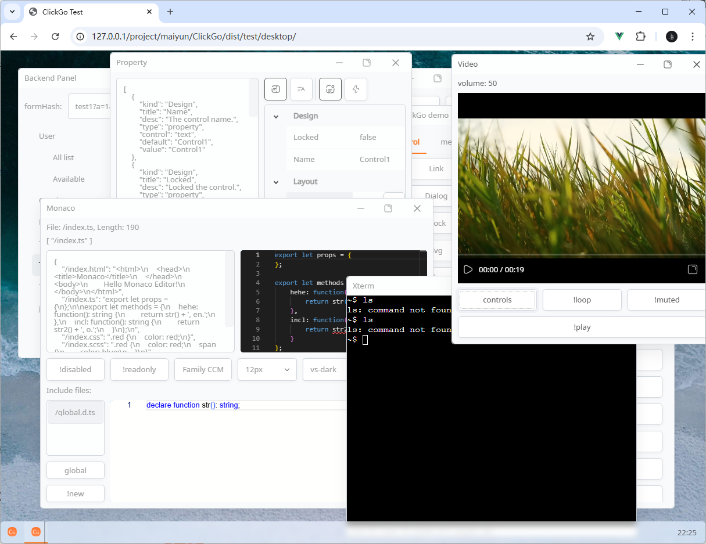
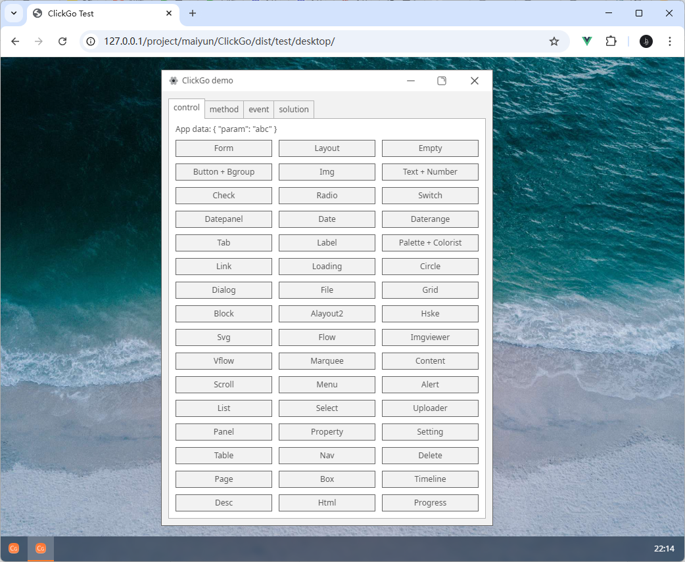

# ClickGo

<p align="center"></p>
<p align="center">
    <a href="https://github.com/maiyun/clickgo/blob/master/LICENSE">
        
    </a>
    <a href="https://www.npmjs.com/package/clickgo">
        
    </a>
    <a href="https://github.com/maiyun/clickgo/releases">
        
    </a>
    <a href="https://github.com/maiyun/clickgo/issues">
        
    </a>
</p>

[简体中文](./doc/README.sc.md)

Build web and native apps using HTML + CSS.

The app compiles into a single `.cga` file, running in the web or natively via [ClickGo Native](https://github.com/maiyun/clickgo-native). Build image editors, database tools, file browsers, or admin dashboards—all with ease.

<p align="center">
    
    
    
</p>

## Usage

You'll need the [ClickGo Compiler](https://github.com/maiyun/clickgo-compiler) to compile the "app" folder into a .cga file. Then compile the entry file and reference it in the browser.

**index.html**

```html
<script type="module" src="index.pack.js"></script>
```

**index.js**

```typescript
import * as clickgo from 'clickgo';
class Boot extends clickgo.AbstractBoot {
    public async main(): Promise<void> {
        await clickgo.task.run(this._sysId, 'xxx.cga');
    }
}
clickgo.launcher(new Boot());
```

### NPM

Use TypeScript? Install via NPM for full IntelliSense support.

```sh
$ npm i clickgo --save-dev
$ npm i jszip --save-dev
$ npm i vue --save-dev
```

## Notes

ClickGo auto-loads Vue, jszip. **Don't** include them manually.

## Demo

Clone and visit "dist/test/index.html".

[Click here to visit online.](https://maiyun.github.io/clickgo/dist/test/)

## License

This library is published under [Apache-2.0](./LICENSE) license.

## Third-party licenses

#### Empty

<a href="https://www.flaticon.com/free-icons/empty" title="empty icons">Empty icons created by Ghozi Muhtarom - Flaticon</a>

#### Greatlist

<a href="https://www.flaticon.com/free-icons/empty" title="empty icons">Empty icons created by Ghozi Muhtarom - Flaticon</a>

#### Img

<a href="https://www.flaticon.com/free-icons/no-photo" title="no photo icons">No photo icons created by kerismaker - Flaticon</a>

#### Icon

<a href="https://www.flaticon.com/free-icons/identity" title="identity icons">Identity icons created by Ghozi Muhtarom - Flaticon</a>  
<a href="https://www.flaticon.com/free-icons/truck" title="truck icons">Truck icons created by Freepik - Flaticon</a>

### **LICENSE:** MIT License **AUTHOR:** sigurdarson

#### Delete

[Close SVG Vector](https://www.svgrepo.com/svg/446990/close)

#### Tag

[Close SVG Vector](https://www.svgrepo.com/svg/446990/close)

#### Date

[Close SVG Vector](https://www.svgrepo.com/svg/446990/close)

#### Daterange

[Close SVG Vector](https://www.svgrepo.com/svg/446990/close)

#### Drawer

[Close SVG Vector](https://www.svgrepo.com/svg/446990/close)

#### Form

[Minus SVG Vector](https://www.svgrepo.com/svg/447026/minus)  
[Copy SVG Vector](https://www.svgrepo.com/svg/446994/copy)  
[Border Radius SVG Vector](https://www.svgrepo.com/svg/446973/border-radius)  
[Close SVG Vector](https://www.svgrepo.com/svg/446990/close)

#### Levelselect

[Key Up SVG Vector](https://www.svgrepo.com/svg/447022/key-up)

#### Menulist Item

[Check SVG Vector](https://www.svgrepo.com/svg/446979/check)

#### Nav

[Menu SVG Vector](https://www.svgrepo.com/svg/447023/menu)

#### Page

[More Horizontal SVG Vector](https://www.svgrepo.com/svg/447028/more-horizontal)

#### Arteditor

[Plus SVG Vector](https://www.svgrepo.com/svg/447037/plus)

#### Uploader

[Plus SVG Vector](https://www.svgrepo.com/svg/447037/plus)
[Trash SVG Vector](https://www.svgrepo.com/svg/447040/trash)

#### Video

[Play SVG Vector](https://www.svgrepo.com/svg/447035/play)  
[Pause SVG Vector](https://www.svgrepo.com/svg/447033/pause)  
[Border Radius SVG Vector](https://www.svgrepo.com/svg/446973/border-radius)  
[Copy SVG Vector](https://www.svgrepo.com/svg/446994/copy)

#### Mpegts

[Play SVG Vector](https://www.svgrepo.com/svg/447035/play)  
[Pause SVG Vector](https://www.svgrepo.com/svg/447033/pause)  
[Border Radius SVG Vector](https://www.svgrepo.com/svg/446973/border-radius)  
[Copy SVG Vector](https://www.svgrepo.com/svg/446994/copy)  
[Speaker 2 SVG Vector](https://www.svgrepo.com/svg/506329/speaker-2)  
[Speaker Cross SVG Vector](https://www.svgrepo.com/show/506328/speaker-cross.svg)

#### Icon

[Close SVG Vector](https://www.svgrepo.com/svg/446990/close)

### **LICENSE:** MIT License **AUTHOR:** Sanity.io

### Icon

[Drag Handle SVG Vector](https://www.svgrepo.com/svg/459043/drag-handle)

### **LICENSE:** CC Attribution License **AUTHOR:** krystonschwarze

#### Uploader

[Drag Vertical SVG Vector](https://www.svgrepo.com/svg/510958/drag-vertical)

### **LICENSE:** MIT License **AUTHOR:** developmentseed

#### Map

[Marker SVG Vector](https://www.svgrepo.com/svg/379072/marker)

### **LICENSE:** CC Attribution License **AUTHOR:** Solar Icons

#### Property

[Siderbar SVG Vector](https://www.svgrepo.com/svg/529875/siderbar)  
[Sort By Alphabet SVG Vector](https://www.svgrepo.com/svg/529901/sort-by-alphabet)  
[Notification Unread Lines SVG](https://www.svgrepo.com/svg/529113/notification-unread-lines)  
[Bolt SVG Vector](https://www.svgrepo.com/svg/528871/bolt)

#### Icon

[Question Circle SVG Vector](https://www.svgrepo.com/svg/522997/question-circle)  
[Info Circle SVG Vector](https://www.svgrepo.com/svg/522904/info-circle)
[Copy SVG Vector](https://www.svgrepo.com/svg/522803/copy)
[Scissors SVG Vector](https://www.svgrepo.com/svg/523012/scissors)
[Paste SVG Vector](https://www.svgrepo.com/svg/489767/paste)
[Sun 2 SVG Vector](https://www.svgrepo.com/svg/529971/sun-2)
[Moon SVG Vector](https://www.svgrepo.com/svg/529729/moon)

### **LICENSE:** CC Attribution License **AUTHOR:** Dazzle UI

#### Icon

[Keyboard SVG Vector](https://www.svgrepo.com/svg/533083/keyboard)
[Eye Slash Alt SVG](https://www.svgrepo.com/svg/532463/eye-slash-alt)  
[Eye Alt SVG Vector ](https://www.svgrepo.com/svg/532492/eye-alt)

### **LICENSE:** CC0 License **UPLOADER:** SVG Repo

#### Iconview

[Folder SVG Vector](https://www.svgrepo.com/svg/474852/folder)  
[File SVG Vector](https://www.svgrepo.com/svg/474842/file)

### **LICENSE:** MIT License **AUTHOR:** instructure-ui

#### Arteditor

[Bold SVG Vector](https://www.svgrepo.com/svg/501109/bold)  
[Italic SVG Vector](https://www.svgrepo.com/svg/501238/italic)
