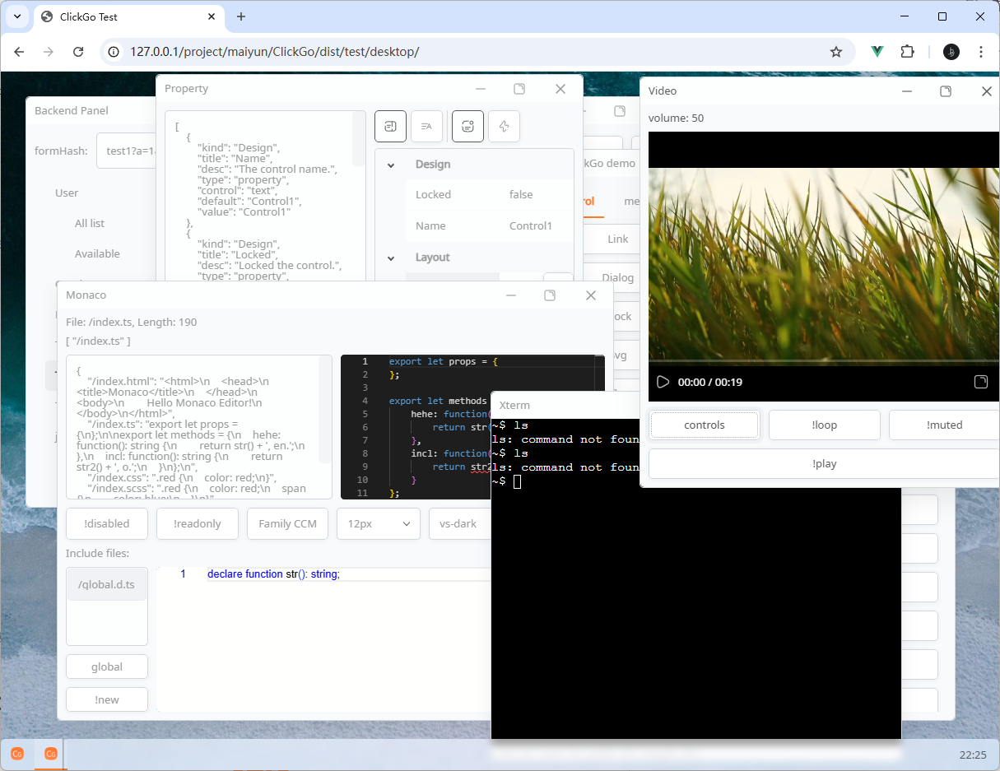
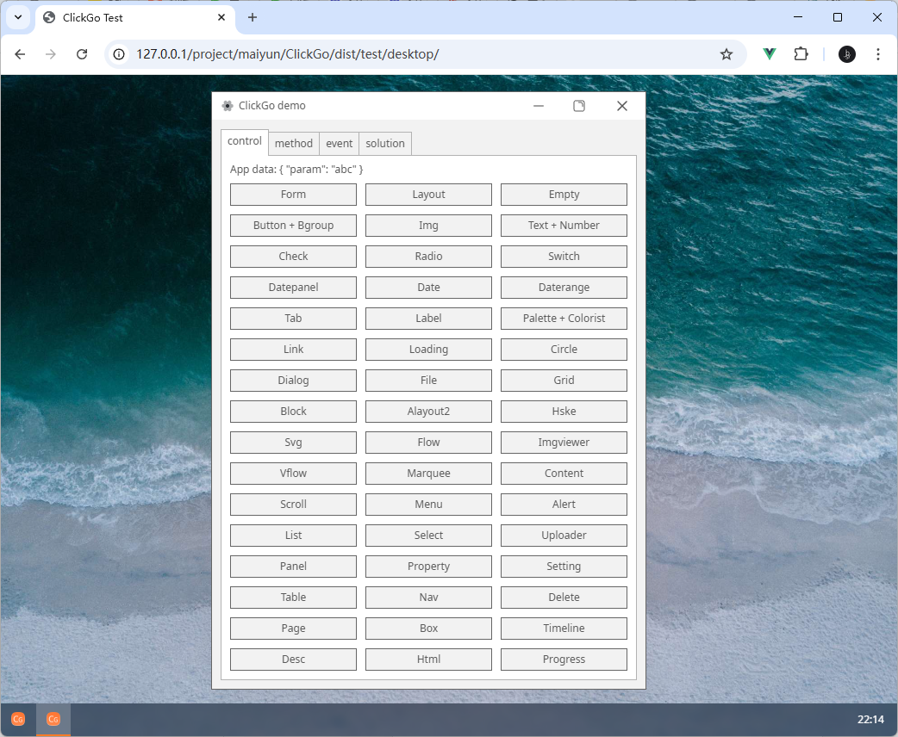
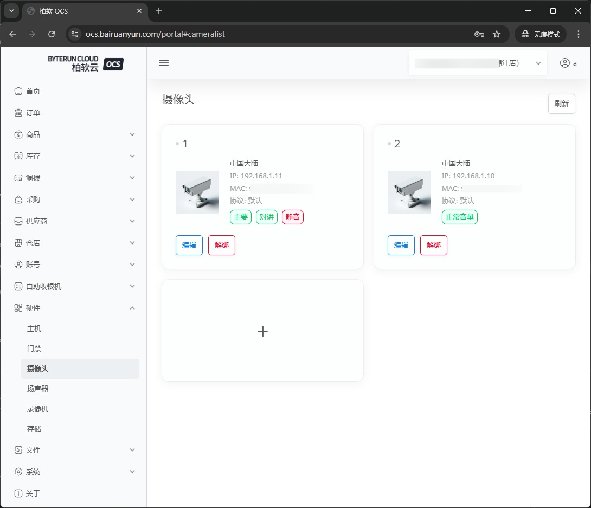

# ClickGo

<p align="center"></p>
<p align="center">
    <a href="https://github.com/maiyun/clickgo/blob/master/LICENSE">
        
    </a>
    <a href="https://www.npmjs.com/package/clickgo">
        
    </a>
    <a href="https://github.com/maiyun/clickgo/releases">
        
    </a>
    <a href="https://github.com/maiyun/clickgo/issues">
        
    </a>
</p>

使用 HTML + CSS 构建 Web、Native 应用。

应用可编译为 cga 单文件，即可以在 Web 中运行，也可以借助 `ClickGo Native` 在本地系统运行。可编写图像编辑器、数据库管理工具、文件浏览器等应用软件，也可编写后台管理面板。

<p align="center">
    
    
    
</p>

## 使用

首先引入模块加载器，然后使用该模块加载器加载它。

**index.html**

```html
<script src="https://cdn.jsdelivr.net/npm/@litert/loader@3.5.8/dist/loader.min.js?path=index&npm={'clickgo':'3.16.22'}"></script>
```

**index.js**

```typescript
import * as clickgo from 'clickgo';
class Boot extends clickgo.AbstractBoot {
    public async main(): Promise<void> {
        await clickgo.task.run('xxx');
    }
}
clickgo.launcher(new Boot());
```

### NPM

TypeScript 环境下，在使用 NPM 安装后，您将得到代码提示。

```sh
$ npm i clickgo --save-dev
$ npm i @litert/loader --save-dev
$ npm i jszip --save-dev
```

## 注意

ClickGo 会自动加载 Vue、jszip 和 resize-observer 库，所以**请勿**引用这些库的 JS 和 CSS 文件，您只需导入 `ClickGo` 模块即可。

## 示例

克隆代码并访问 "dist/test/index.html"。

[点击这里在线访问](https://maiyun.github.io/clickgo/dist/test/)

## 许可

ClickGo 基于 [Apache-2.0](./LICENSE) 协议发布。